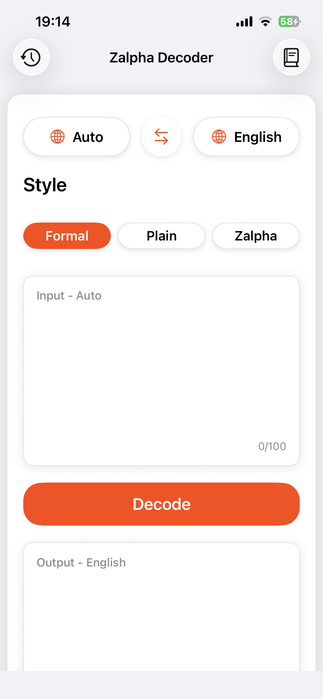
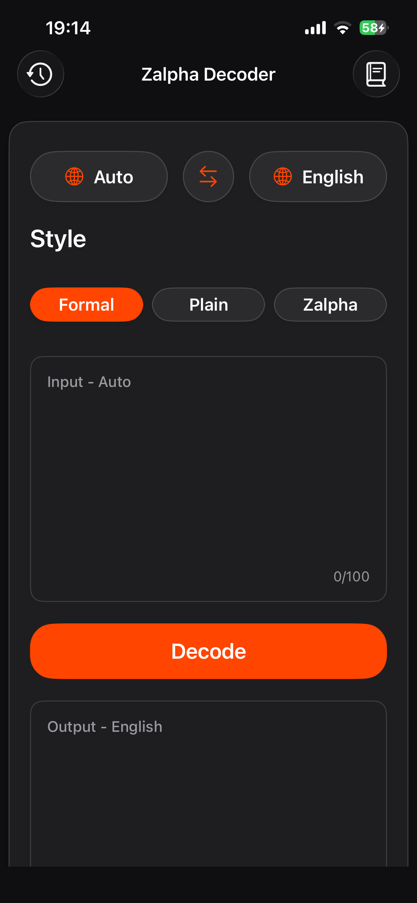
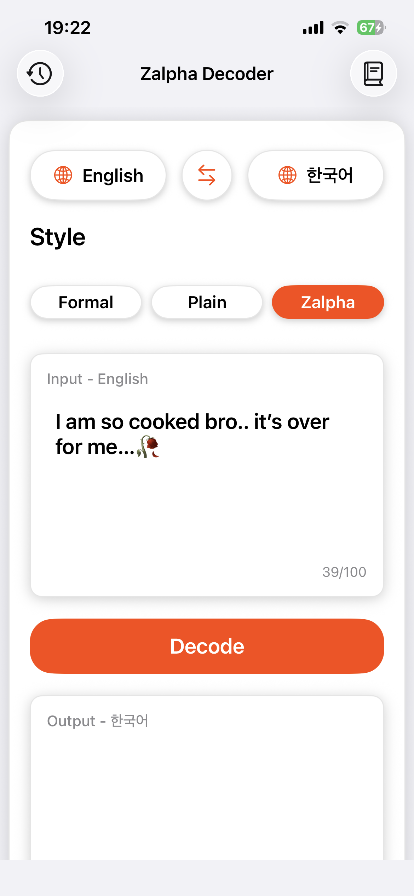
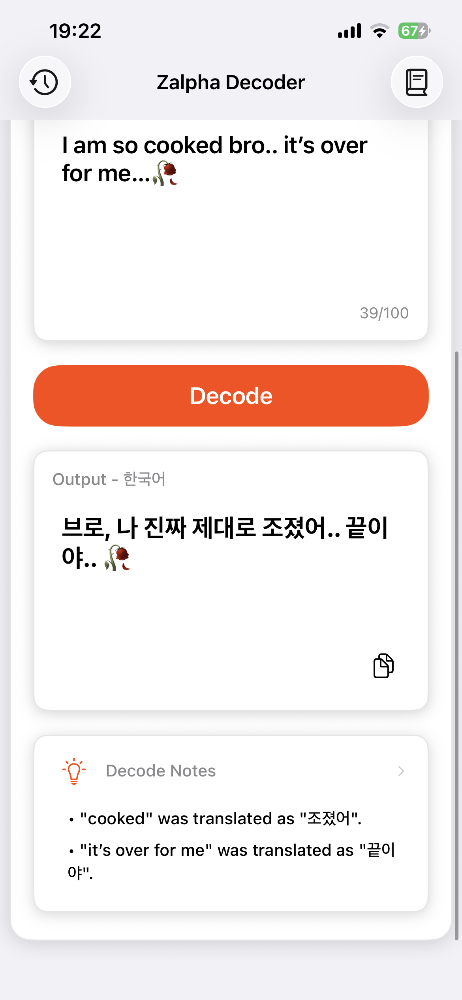
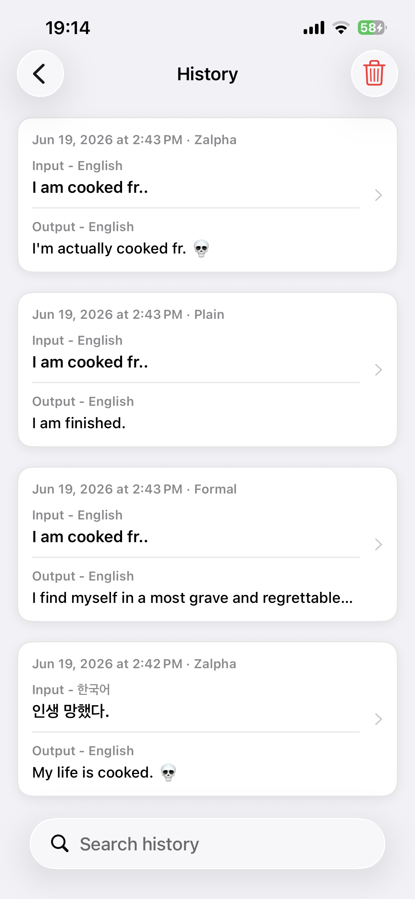
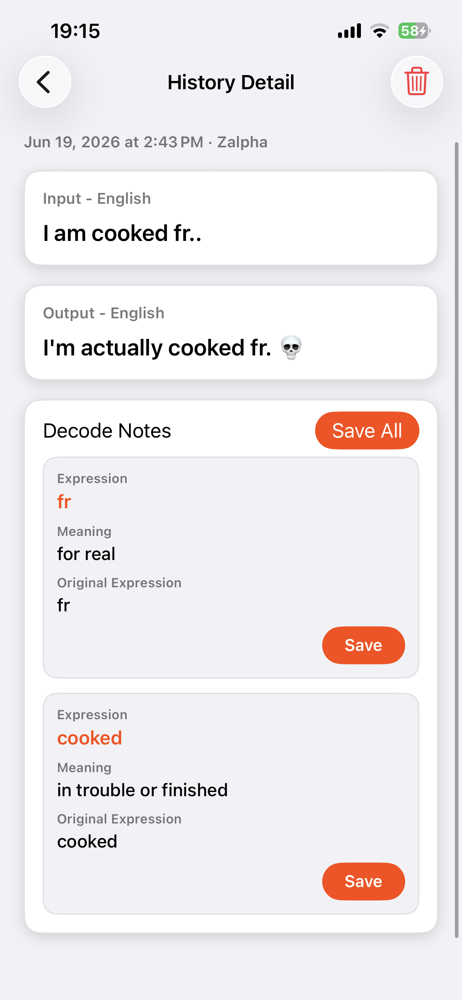
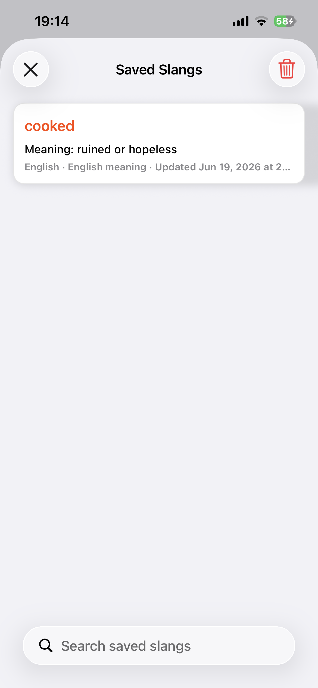
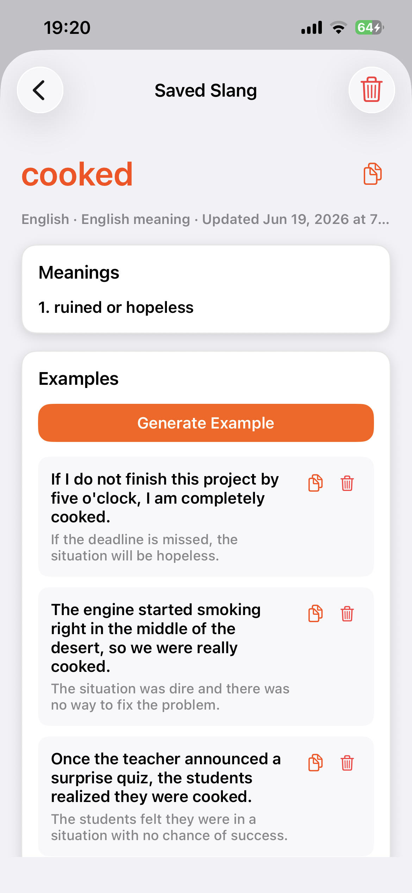
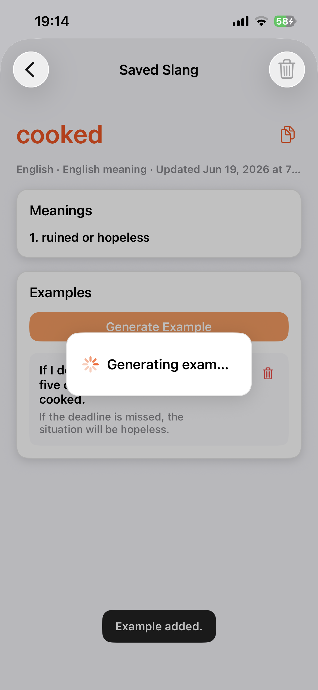

# Zalpha Decoder

[한국어 README](README.ko.md)

Zalpha Decoder is named by combining Zalpha, meaning Alpha + Gen Z, and Decoder.

Zalpha Decoder is a Storyboard-based UIKit iOS app that translates input text into a selected style and target language, while also explaining key expressions.

AI responses are implemented with Firebase AI Logic and Gemini. The app also stores local decode history and saved target-language expressions for later review.

## Demo Video - Click to open YouTube

[](https://www.youtube.com/watch?v=FZlDrd5T-ns)

## Features

- Decode and translate short text with Firebase AI Logic + Gemini
- Source language: `Auto`, `English`, `Korean`, `Japanese`, `Spanish`, `Russian`
- Target language: `English`, `Korean`, `Japanese`, `Spanish`, `Russian`
- Style selection: `Formal`, `Plain`, `Zalpha`
- AI-generated notes for meaningful slang, idioms, meme expressions, abbreviations, and culturally loaded phrases
- Local history storage for up to 50 records
- Saved Slangs screen with search, detail view, generated examples, copy, and delete actions
- Up to 3 generated examples for each saved expression
- Light/dark mode UI and app icon support

## Screenshots

### App Icon

| Light | Dark |
| --- | --- |
|  |  |

### Feature Walkthrough

#### 1. Main Screen

The main screen contains the source/target language controls, style selection, input box, decode button, output box, and decode notes area.

| Light Mode | Dark Mode |
| --- | --- |
|  |  |

#### 2. Decode Result

After tapping `Decode`, Gemini returns a style-aware translation and structured decode notes for meaningful expressions.

| Translation Result | Decode Notes |
| --- | --- |
|  |  |

#### 3. History

Successful decodes are saved locally. The history list shows recent input/output summaries, and the detail screen shows the full decode result and notes.

| History List | History Detail |
| --- | --- |
|  |  |

#### 4. Saved Slangs

Decode notes can be saved as target-language expressions. Saved Slangs supports local search, detail view, copy, delete, and example generation.

| Saved Slangs | Saved Slang Detail | Generated Example |
| --- | --- | --- |
|  |  |  |

## Tech Stack

| Category | Tech |
| --- | --- |
| Language |  |
| UI |   |
| AI |   |
| Local Storage |   |
| Localization |  |

## Project Structure

```text
ZalphaDecoder/
  AIService.swift                         # Prompt, Gemini request, and response parsing coordinator
  FirebaseAITextClient.swift              # Firebase AI Logic client
  AIServicePromptBuilder.swift            # Decode and example-generation prompts
  AIServiceResponseParser.swift           # JSON response parsing
  DecodeLanguage.swift                    # Supported language options
  TranslationStyle.swift                  # Formal, Plain, Zalpha styles
  ViewController.swift                    # Main decode screen
  HistoryViewController.swift             # Local decode history list
  HistoryDetailViewController.swift       # Decode detail and notes
  SavedSlangsViewController.swift         # Saved slang list and search
  SavedSlangDetailViewController.swift    # Saved slang detail and examples
  Base.lproj/Main.storyboard              # Main storyboard UI
  Assets.xcassets/                        # App assets and app icons
```

## Firebase Setup

This project requires a local Firebase config file:

```text
ZalphaDecoder/GoogleService-Info.plist
```

Do not commit the real `GoogleService-Info.plist`. Use `ZalphaDecoder/GoogleService-Info.example.plist` as a reference, then download the real file from Firebase Console.

Firebase AI Logic must be enabled in Firebase Console and configured for Gemini.
